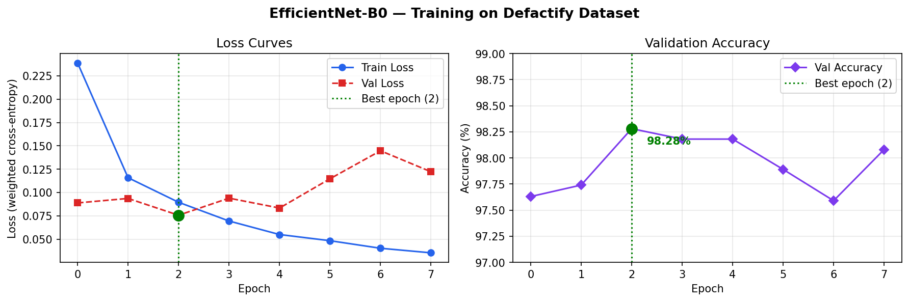
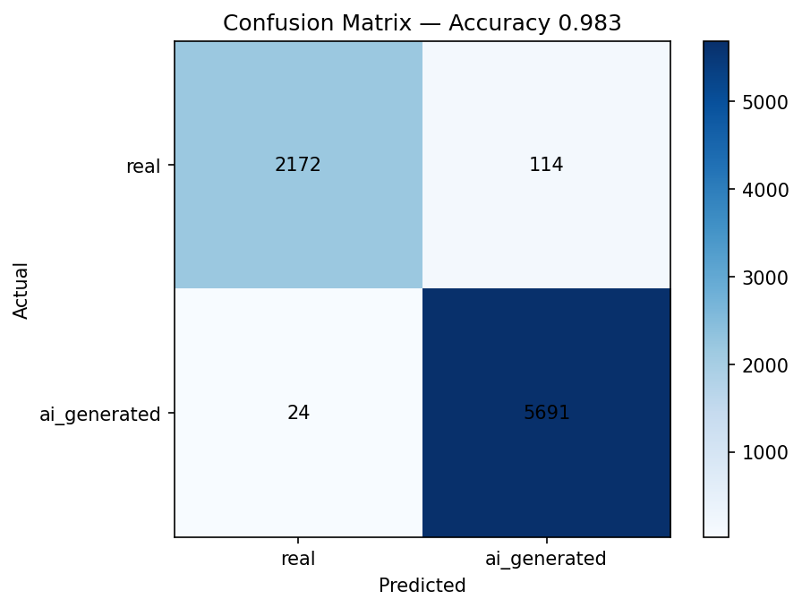
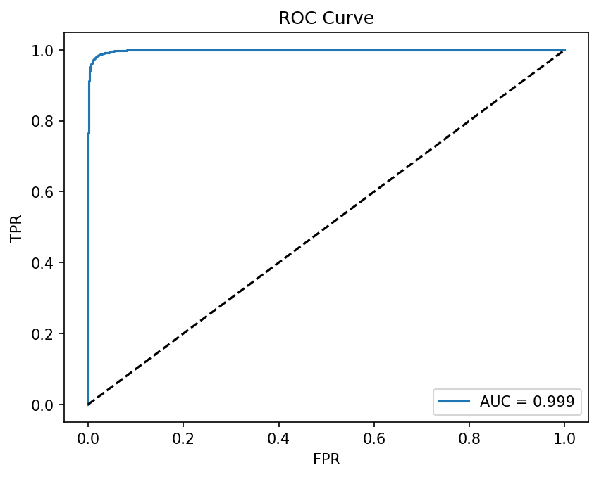

# זיהוי תמונות מזויפות שנוצרו בבינה מלאכותית

## RealOrFake — דוח סיום פרויקט

**קורס:** מולטימדיה ולמידת מכונה  
**תלמידים:** אדיר שלומוב, פלורה  
**תאריך:** מאי 2026

---

## 1. רקע ובעיה

בשנים האחרונות חלה עלייה דרמטית ביכולת כלים מבוססי בינה מלאכותית — כגון Midjourney, DALL·E 3 ו-Stable Diffusion — ליצור תמונות פוטוריאליסטיות שאינן ניתנות להבחנה מתמונות אמיתיות בעין האנושית. תופעה זו מהווה איום ממשי על אמינות המידע החזותי ברשת: הפצת פייק-ניוז, זיוף ראיות, יצירת זהויות מזויפות ברשתות חברתיות, ועוד.

**מטרת הפרויקט:** פיתוח מערכת המסוגלת לסווג תמונה כ"אמיתית" (צולמה במצלמה) או כ"מזויפת" (נוצרה בבינה מלאכותית), ולספק הסבר חזותי להחלטת המודל באמצעות מפת חום (Grad-CAM).

**ערך מוסף:** הפתרון מיועד לעיתונאים, פלטפורמות מדיה חברתית, ומשתמשים פרטיים שרוצים לאמת תמונות לפני שיתוף.

---

## 2. תיאור הדאטה

### מקור הנתונים — Defactify Dataset

השתמשנו בדאטאסט **Defactify** שפורסם במסגרת תחרות AAAI 2025, המכיל:

| פרמטר                 | ערך                                               |
| --------------------- | ------------------------------------------------- |
| סה"כ תמונות שהורדו    | 56,000                                            |
| תמונות אמיתיות        | 16,000 (מקור: MS COCO)                            |
| תמונות AI             | 40,000 (Midjourney v6, DALL·E 3, SDXL, SD3)       |
| חלוקה אימון/ולידציה   | 85% / 15%                                         |
| גנרטורים              | Midjourney v6, DALL·E 3, Stable Diffusion XL, SD3 |
| תמונות אמיתיות (מקור) | MS COCO (צילומי יומיום מגוונים)                   |

**חוסר איזון בדאטה:** הדאטאסט אינו מאוזן — יחס של כ-1:2.5 (real:fake). טיפלנו בכך באמצעות **class weights אוטומטיים** בפונקציית ה-loss:

- משקל real: **1.75**
- משקל fake: **0.70**

**עיבוד מקדים:**

- כיווץ לרזולוציה של 256×256 פיקסלים
- נירמול לפי ממוצע ושונות של ImageNet (mean=[0.485, 0.456, 0.406], std=[0.229, 0.224, 0.225])
- Augmentations: flip אופקי אקראי, שינויי בהירות/ניגוד, JPEG compression אקראי (30% הסתברות, quality=75)

---

## 3. המודל והאימון

### ארכיטקטורה — EfficientNet-B0 עם Transfer Learning

בחרנו ב-**EfficientNet-B0** על בסיס weights מאומנים מראש על ImageNet (1.28M תמונות, 1000 קטגוריות). זוהי גישת **Transfer Learning**: הרשת למדה כבר לזהות פיצ'רים בסיסיים (קצוות, טקסטורות, צורות) ואנחנו כוונו ("fine-tuned") אותה לזהות פיצ'רים ספציפיים של תמונות AI.

**שינויים לארכיטקטורה:**

- הוחלפה שכבת הסיווג הסופית ב: `Dropout(0.3) → Linear(1280→256) → ReLU → Dropout(0.3) → Linear(256→2)`
- כל הפרמטרים (backbone + classifier) אומנו

**פרמטרי אימון:**
| פרמטר | ערך |
|---|---|
| Optimizer | AdamW |
| Learning Rate | 5×10⁻⁵ |
| Weight Decay | 1×10⁻⁴ |
| Batch Size | 32 |
| Scheduler | Cosine Annealing |
| Early Stopping | patience=5, min_delta=5×10⁻⁴ |
| Device | Apple Silicon MPS |

**תהליך האימון:**
האימון הופסק אוטומטית לאחר 8 epochs (early stopping), כאשר המודל הטוב ביותר הושג ב-**epoch 2**.

---

## 4. תוצאות

### מטריקות ביצועים — Val Set (8,000 תמונות)

| מטריקה          | ערך                |
| --------------- | ------------------ |
| **Accuracy**    | **98.28%**         |
| **AUC (ROC)**   | **0.9986**         |
| Best Epoch      | 2                  |
| Epochs עד עצירה | 8 (early stopping) |

### גרפי אימון

_איור 1: עקומות Loss ו-Accuracy לאורך האימון. ניתן לראות התכנסות מהירה ב-epoch 2._

### Confusion Matrix

_איור 2: Confusion Matrix על ה-Validation Set._

### ROC Curve

_איור 3: עקומת ROC — AUC גבוה מעיד על הבחנה טובה בין מחלקות._

### Grad-CAM — הסבר חזותי

המערכת מייצרת מפת חום (Grad-CAM) שמדגישה את האזורים בתמונה שהשפיעו ביותר על ההחלטה:

- **פנים ועור** — המודל מזהה texture חלק מדי האופייני ל-AI
- **שיער ופרטים עדינים** — AI מייצר לעיתים חוסר קוהרנטיות
- **קצוות אובייקט-רקע** — AI מחבר אובייקטים בצורה שונה מצילום אמיתי

---

## 5. קשיים ומסקנות

### קשיים שנתקלנו בהם

1. **חוסר איזון בדאטאסט (1:2.5):** הדאטאסט Defactify מכיל פי 2.5 יותר תמונות AI מאשר אמיתיות. פתרנו זאת עם class weights.

2. **תאימות Python 3.9:** שגיאות syntax (`str | None`) בגרסת Python הישנה — תוקן עם `Optional[str]` מ-typing.

3. **זיכרון RAM בהורדת הדאטה:** ניסיון לצבור 80K תמונות בזיכרון גרם ל-crash. פתרנו בשמירה ישירה לדיסק תוך כדי streaming.

4. **MPS ו-pin_memory:** Apple Silicon אינו תומך ב-pin_memory=True בDataLoader — תוקן לאוטומטי לפי סוג ה-device.

5. **GradCAM עם no_grad:** ה-decorator `@torch.no_grad()` מנע gradients הנדרשים ל-GradCAM. תוקן לשימוש ב-context manager רק על ה-forward pass הסיווגי.

### מסקנות

- EfficientNet-B0 עם Transfer Learning מספק ביצועים מצוינים (**98.28% accuracy**) על זיהוי תמונות AI גם עם דאטאסט יחסית קטן.
- זמן עיבוד של **~66ms** לתמונה על CPU — מהיר מספיק לשימוש בזמן אמת.
- GradCAM מספק שקיפות לגבי ההחלטה ומעלה את אמון המשתמש במערכת.

### כיוונים עתידיים

- אימון על דאטאסט גדול יותר (1M+ תמונות) עם גנרטורים נוספים
- הוספת זיהוי Deepfake בסרטוני וידאו (כבר ממומש חלקית)
- פרסום המודל כ-API ציבורי לשימוש עיתונאים וחוקרים
- Fine-tuning על גנרטורים חדשים (Sora, Gemini Imagen 3)

---

_הפרויקט פותח בקורס מולטימדיה ולמידת מכונה, 2025–2026._  
_קוד מקור: [GitHub Repository](https://github.com/IconiqMotion/real-or-fake)_
